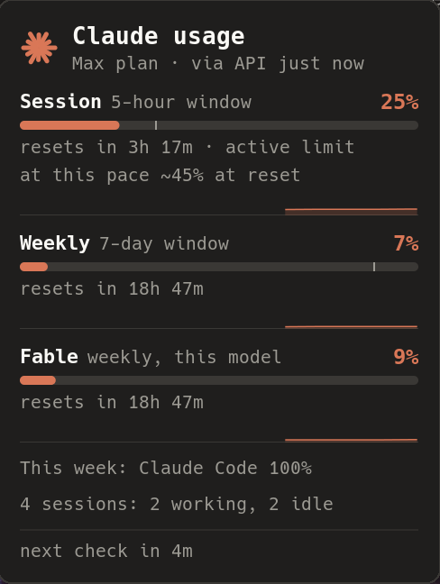

# awesome-claude-usage

An [AwesomeWM](https://awesomewm.org/) wibar widget that shows how much of your
[Claude Code](https://code.claude.com/) subscription limits you have used: the
5-hour session window and the 7-day weekly window, exactly like `/usage` inside
Claude Code, without opening a terminal.

```
 5h 3% · 7d 67%
```

Hover for the details (reset times, per-model weekly limits, extra usage, data
age), get a desktop notification when a window crosses a threshold, click to
open Claude Code.




## Features

- Bar text `5h 3% · 7d 67%` with a Nerd Font glyph, coloured by threshold (75 % / 90 % by default)
- Hover popup: `resets in 2h 14m`, model-scoped weekly limits (e.g. `Fable: 51%`),
  weekly usage by surface, extra-usage spend, data source and age, next check
- Desktop notification once per threshold crossing, re-armed after the window resets
- Left click opens a terminal with `claude` (configurable), right click refreshes, middle click pins the popup
- Three data sources with automatic fallback:
  1. Claude Code's OAuth usage endpoint (`api.anthropic.com/api/oauth/usage`), polled every 5 minutes
  2. a cache file written by the Claude Code **statusLine** (see below), no network needed
  3. `~/.claude.json`, Claude Code's own cached copy of the last `/usage` result
- Exponential backoff on HTTP 429 and network errors; the bar never hammers the endpoint
- Reads the OAuth token only. It never refreshes or writes it, so it cannot log you out.
- Pure Lua, no LuaRocks dependencies; `curl` is the only external tool (`jq` for the optional statusLine helper)

## Requirements

- AwesomeWM 4.3 or the git version (API level 4)
- `curl`
- Claude Code, logged in with a claude.ai Pro or Max subscription (API-key users have no rate-limit windows)
- A [Nerd Font](https://www.nerdfonts.com/) for the glyph, or set `glyph` to plain text

## Installation

```sh
git clone https://github.com/derblub/awesome-claude-usage.git ~/.config/awesome/claude_usage
```

Then in `rc.lua`:

```lua
local claude_usage = require("claude_usage")

-- ... inside your wibar setup:
s.mywibox:setup({
    layout = wibox.layout.align.horizontal,
    { layout = wibox.layout.fixed.horizontal, s.mytaglist },
    s.mytasklist,
    {
        layout = wibox.layout.fixed.horizontal,
        claude_usage.new({ on_click = terminal .. " -e claude" }),
        mytextclock,
    },
})
```

The directory name does not matter: clone it as `claude_usage`, `awesome-claude-usage`
or anything else and `require` that name.

## Configuration

Every option is optional. Defaults shown.

```lua
claude_usage.new({
    -- Polling
    interval      = 300,      -- seconds between fetches (minimum 120; lower values only earn 429s)
    initial_delay = 5,        -- seconds after startup before the first fetch
    jitter        = 30,       -- random +/- seconds on every interval
    timeout       = 15,       -- curl --max-time
    backoff       = { 300, 600, 1200, 1800 }, -- delays after consecutive 429/5xx/network errors
    sources       = { "api", "statusline", "claude_json" }, -- priority; remove entries to disable
    credentials_path = os.getenv("HOME") .. "/.claude/.credentials.json",
    claude_json_path = os.getenv("HOME") .. "/.claude.json",
    cache_path    = (os.getenv("XDG_CACHE_HOME") or os.getenv("HOME") .. "/.cache") .. "/claude-usage/rate_limits.json",
    stale_after   = 3600,     -- cached data older than this is marked "(stale)"

    -- Appearance
    font          = nil,      -- nil = beautiful.font
    glyph         = "\u{f0e7}", -- Nerd Font bolt; try "\u{f06a9}" (robot) or "" for none
    show_glyph    = true,
    separator     = " · ",
    forced_width  = nil,      -- e.g. dpi(120) for a fixed width
    thresholds    = { warn = 75, crit = 90 },
    colors        = { normal = nil, warn = "#e5c07b", crit = "#e06c75", error = "#5c6370", stale = nil },
                              -- nil = inherit the surrounding foreground colour
    color_target  = "text",   -- "none": never colour the text, do it yourself via subscribe()
    format        = nil,      -- custom bar text, see below

    -- Popup
    popup         = true,     -- built-in hover popup; false to build your own
    popup_bg = nil, popup_fg = nil, popup_border_color = nil, popup_border_width = 1,
    popup_show_scoped = true, popup_show_spend = true, popup_show_breakdown = true,

    -- Notifications (naughty)
    notify_threshold = true,  -- when a window crosses warn/crit
    notify_reset     = false, -- when a window resets after it was above warn
    notify_error     = false, -- after three consecutive failed checks without any data
    notify_timeout   = 8,

    -- Mouse
    on_click        = "xterm -e claude", -- string: run with a shell; function(state, widget)
    on_right_click  = nil,    -- default: refresh now
    on_middle_click = nil,    -- default: pin/unpin the popup
})
```

### Custom bar text

```lua
format = function(state, fmt)
    if not fmt.has_data(state) then return "claude ?" end
    return string.format("W %d%%", fmt.round(state.seven_day.percent))
end
```

`state` is described below; `fmt` is the `claude_usage.format` helper table
(`round`, `relative`, `age`, `has_data`, `level_for`, `popup_lines`, ...).
Return plain text; the widget escapes it for Pango.

### Using the model without the built-in widget or popup

```lua
local claude_usage = require("claude_usage")
claude_usage.setup({ popup = false })

claude_usage.subscribe(function(state)
    -- called immediately if data exists, then on every update (about once a minute)
    my_textbox.text = claude_usage.format.bar_text(state, claude_usage.opts)
    my_tooltip.text = table.concat(claude_usage.format.popup_lines(state, os.time(), claude_usage.opts), "\n")
end)
```

The state table:

```lua
{
    five_hour  = { percent = 3,  resets_at = 1790023800, is_active = false },  -- or nil
    seven_day  = { percent = 67, resets_at = 1790175600, is_active = true },   -- or nil
    scoped     = { { name = "Fable", percent = 51, resets_at = 1790175600 } }, -- per-model weekly limits
    spend      = { enabled = false, percent = 0, used = 0, currency = "USD", limit = nil }, -- extra usage
    breakdown  = { { name = "Claude Code", percent = 89 }, { name = "Chats", percent = 11 } },
    fetched_at = 1758560000,  -- epoch seconds when the data was produced
    source     = "api",       -- "api" | "statusline" | "claude_json"
    stale      = false,
    error      = nil,         -- or { code = "rate_limited", message = "...", retry_at = ... }
    next_fetch_at = 1758560300,
    subscription  = "max",
}
```

`error.code` is one of `unauthorized`, `no_credentials`, `rate_limited`,
`network`, `parse`, `no_source`. When a fetch fails but cached data exists,
both the data and the error are present.

## The statusLine helper (fresh data without network calls)

Claude Code passes a JSON document with a `rate_limits` object to your
[statusLine](https://code.claude.com/docs/en/statusline) command on every turn.
`contrib/statusline-cache.sh` stores that object in
`~/.cache/claude-usage/rate_limits.json` (mode 600, written atomically) and then
hands the unchanged JSON to your existing statusline command, if any.

`~/.claude/settings.json`:

```json
{
  "statusLine": {
    "type": "command",
    "command": "~/.config/awesome/claude_usage/contrib/statusline-cache.sh"
  }
}
```

With an existing statusline script, append it as an argument:

```json
"command": "~/.config/awesome/claude_usage/contrib/statusline-cache.sh ~/.claude/my-statusline.sh"
```

Requires `jq`. The cache only updates while a Claude Code session is running;
the widget marks it stale after an hour and prefers the API when that works.
To rely on the cache alone (no network at all): `sources = { "statusline" }`.

## How polling and rate limiting work

The usage endpoint is the one Claude Code itself calls for `/usage`. It is not
documented and it rate-limits aggressively: too many calls and it answers
`429` for a while. The widget therefore

- polls every 5 minutes with a little jitter (`interval` cannot go below 120 s),
- backs off exponentially after a 429, 5xx or network error (5, 10, 20, 30 minutes),
- refuses a forced refresh (right click) while backing off and says so in the popup,
- falls back to the statusLine cache and `~/.claude.json` so the bar keeps showing numbers.

The access token comes from `~/.claude/.credentials.json`. Claude Code refreshes
that token itself when you run it; this widget deliberately does **not**
implement the refresh flow, because two programs rotating the same refresh token
can log each other out. When the token has expired the bar shows `!auth`; run
any `claude` command and the next check succeeds.

## Security

- The token is read from a file only you can read (mode 600) and passed to a
  local `curl` process as an argument. It is never logged, stored elsewhere or
  sent anywhere except `api.anthropic.com`.
- Nothing is written to `~/.claude/`. The only file the project writes is its
  own cache under `~/.cache/claude-usage/`, and only through the statusLine helper.
- No third-party services are involved.

## Troubleshooting

| Bar shows | Meaning | What to do |
|---|---|---|
| `!auth` | token expired or rejected (401/403) | run any `claude` command, wait for the next check or right-click |
| `!cred` | `~/.claude/.credentials.json` missing or unreadable | log in with `claude` |
| `!429` | rate limited and no cached data | wait; do not lower `interval` |
| `!net` | curl failed or 5xx, no cached data | check connectivity; the widget retries with backoff |
| `!none` | every source failed | check the popup for the last error |
| `5h --` | that window is absent from the response (e.g. no subscription) | nothing to do |
| a box instead of the glyph | no Nerd Font | set `font` or `glyph` |

Awesome's error output (`~/.cache/awesome/stderr.log` or the tty) shows
`claude_usage:` warnings for misconfiguration and subscriber errors.

## Development

```sh
make test     # runs spec/ with lua5.4 and luajit in two time zones, no dependencies
make lint     # luacheck (install via luarocks)
```

The pure modules (`normalize`, `format`, `timeparse`, `backoff`, `notify`,
`model`) run without AwesomeWM; `widget.lua`, `popup.lua` and `init.lua` need it.

## License

MIT, see [LICENSE](LICENSE). `json.lua` is [rxi/json.lua](https://github.com/rxi/json.lua), also MIT.

This project is not affiliated with Anthropic. The usage endpoint is
undocumented and may change or disappear; the widget degrades to its cached
sources when it does.
